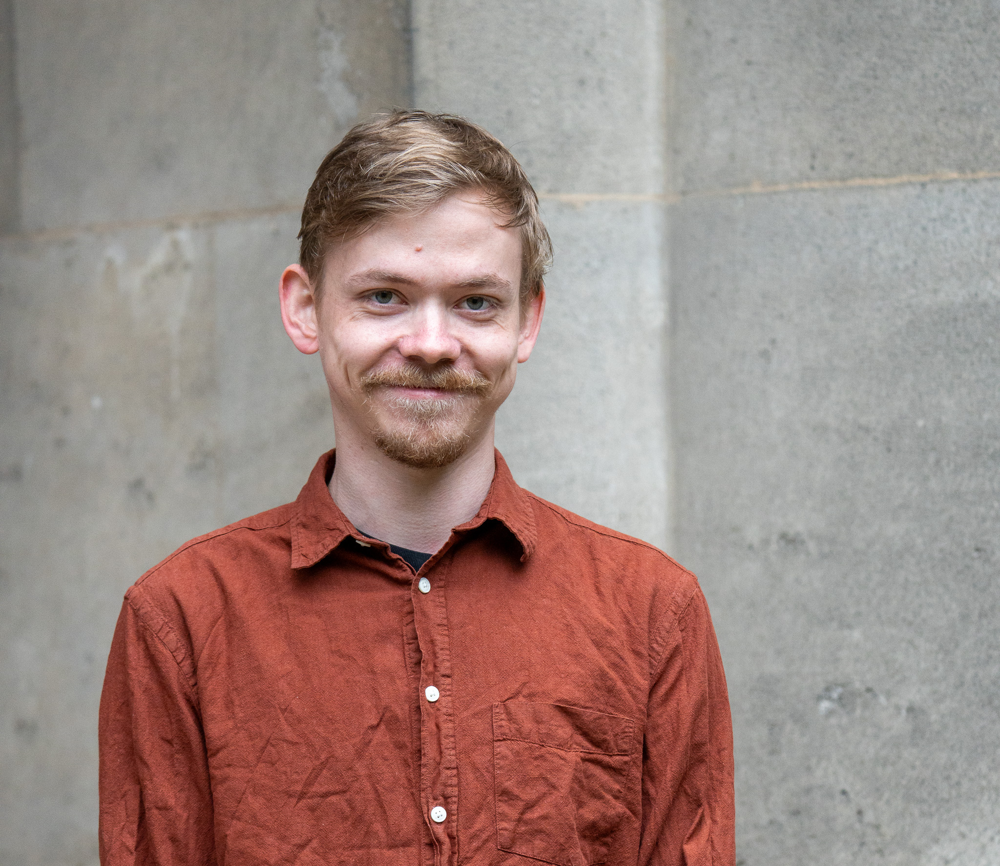

---
# Feel free to add content and custom Front Matter to this file.
# To modify the layout, see https://jekyllrb.com/docs/themes/#overriding-theme-defaults

layout: home
---
  
Hi! I am Marvin Stecker.   
I am a PhD student at the <a href="https://compcommlab.univie.ac.at/">Computational Communication Science Lab</a> at the University of Vienna. I am part of the <a href="https://authlib.eu/">AUTHLIB</a> project on illiberal challenges to democracy, and previously worked in the <a href="https://opted.eu/">OPTED</a> project on infrastructures for political text analysis. 

My research focuses on two broad areas: substantially I focus on social groups and their identities in the political space, focussing on their meaning, their contestation and influence on political behaviour. I am also interested in methodological questions, particularly around computational approaches such as natural language processing or simulation studies, and work on their development and validation.

Find out more about me in <a href="about">text</a> or <a href="cv">list</a> form, depending on your love of bullet points.