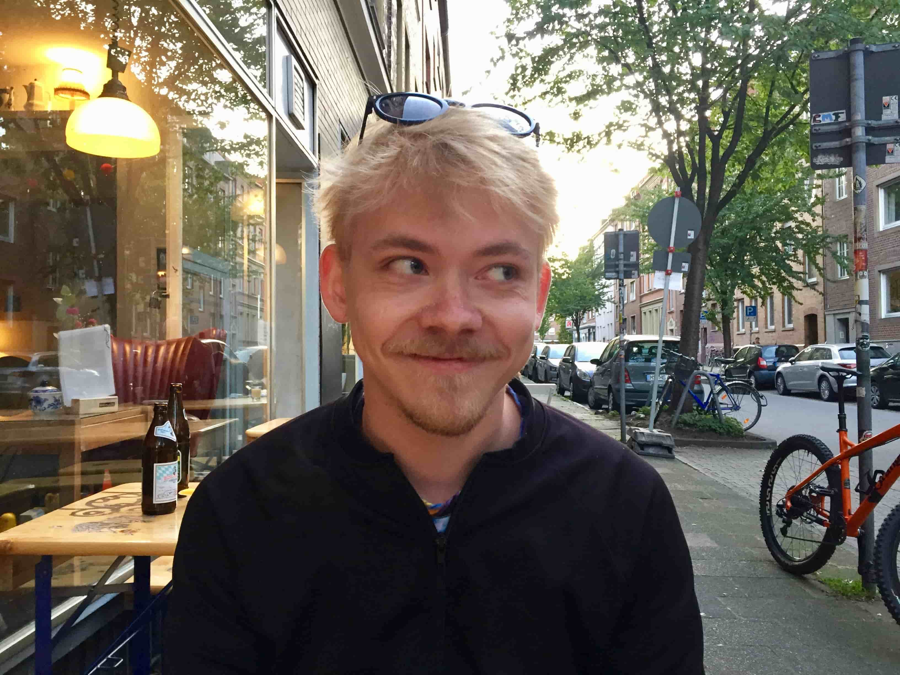

---
# Feel free to add content and custom Front Matter to this file.
# To modify the layout, see https://jekyllrb.com/docs/themes/#overriding-theme-defaults

layout: home
---
  
Hi! I am Marvin Stecker.   
I am currently completing my Master's in Communication Science at the WWU University in Münster.  

I am interested in social inequalities, questions of knowledge and aspects of Critical Theory.  I am comfortable both with quantitative and qualitative research projects, but my pet project are computational approaches.

<a href="about">About</a> tells you more about, surprisingly, me. 
<a href="comp">Comp. Tools</a> is a (very brief so far) overview of tools I developed for my analysis purposes.   
<a href="resume">Resume</a> <del>contains my secret pizza recipe</del> is for the headhunters.   